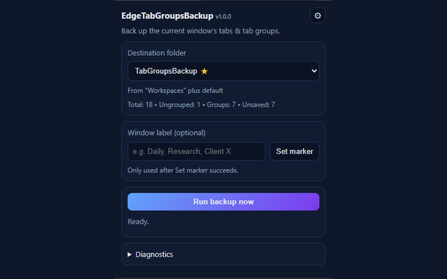
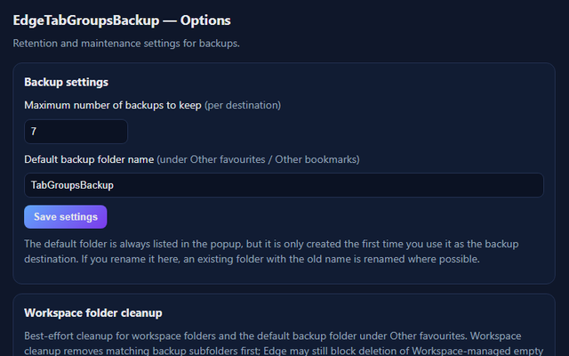

# EdgeTabGroupsBackup (Edge extension)

[![Edge Addon Version](https://img.shields.io/badge/dynamic/json?style=flat-square&logo=data:image/svg+xml;base64,PHN2ZyB4bWxucz0iaHR0cDovL3d3dy53My5vcmcvMjAwMC9zdmciIHZpZXdCb3g9IjAgMCAyNCAyNCI+PHBhdGggZD0iTTIxLjg2IDE3Ljg2cS4xNCAwIC4yNS4xMi4xLjEzLjEuMjV0LS4xMS4zM2wtLjMyLjQ2LS40My41My0uNDQuNXEtLjIxLjI1LS4zOC40MmwtLjIyLjIzcS0uNTguNTMtMS4zNCAxLjA0LS43Ni41MS0xLjYuOTEtLjg2LjQtMS43NC42NHQtMS42Ny4yNHEtLjkgMC0xLjY5LS4yOC0uOC0uMjgtMS40OC0uNzgtLjY4LS41LTEuMjItMS4xNy0uNTMtLjY2LS45Mi0xLjQ0LS4zOC0uNzctLjU4LTEuNi0uMi0uODMtLjItMS42NyAwLTEgLjMyLTEuOTYuMzMtLjk3Ljg3LTEuOC4xNC45NS41NSAxLjc3LjQxLjgyIDEuMDIgMS41LjYuNjggMS4zOCAxLjIxLjc4LjU0IDEuNjQuOS44Ni4zNiAxLjc3LjU2LjkyLjIgMS44LjIgMS4xMiAwIDIuMTgtLjI0IDEuMDYtLjIzIDIuMDYtLjcybC4yLS4xLjItLjA1em0tMTUuNS0xLjI3cTAgMS4xLjI3IDIuMTUuMjcgMS4wNi43OCAyLjAzLjUxLjk2IDEuMjQgMS43Ny43NC44MiAxLjY2IDEuNC0xLjQ3LS4yLTIuOC0uNzQtMS4zMy0uNTUtMi40OC0xLjM3LTEuMTUtLjgzLTIuMDgtMS45LS45Mi0xLjA3LTEuNTgtMi4zM1QuMzYgMTQuOTRRMCAxMy41NCAwIDEyLjA2cTAtLjgxLjMyLTEuNDkuMzEtLjY4LjgzLTEuMjMuNTMtLjU1IDEuMi0uOTYuNjYtLjQgMS4zNS0uNjYuNzQtLjI3IDEuNS0uMzkuNzgtLjEyIDEuNTUtLjEyLjcgMCAxLjQyLjEuNzIuMTIgMS40LjM1LjY4LjIzIDEuMzIuNTcuNjMuMzUgMS4xNi44My0uMzUgMC0uNy4wNy0uMzMuMDctLjY1LjIzdi0uMDJxLS42My4yOC0xLjIuNzQtLjU3LjQ2LTEuMDUgMS4wNC0uNDguNTgtLjg3IDEuMjYtLjM4LjY3LS42NSAxLjM5LS4yNy43MS0uNDIgMS40NC0uMTUuNzItLjE1IDEuMzh6TTExLjk2LjA2cTEuNyAwIDMuMzMuMzkgMS42My4zOCAzLjA3IDEuMTUgMS40My43NyAyLjYyIDEuOTMgMS4xOCAxLjE2IDEuOTggMi43LjQ5Ljk0Ljc2IDEuOTYuMjggMSAuMjggMi4wOCAwIC44OS0uMjMgMS43LS4yNC44LS42OSAxLjQ4LS40NS42OC0xLjEgMS4yMi0uNjQuNTMtMS40NS44OC0uNTQuMjQtMS4xMS4zNi0uNTguMTMtMS4xNi4xMy0uNDIgMC0uOTctLjAzLS41NC0uMDMtMS4xLS4xMi0uNTUtLjEtMS4wNS0uMjgtLjUtLjE5LS44NC0uNS0uMTItLjA5LS4yMy0uMjQtLjEtLjE2LS4xLS4zMyAwLS4xNS4xNi0uMzUuMTYtLjIuMzUtLjUuMi0uMjguMzYtLjY4LjE2LS40LjE2LS45NSAwLTEuMDYtLjQtMS45Ni0uNC0uOTEtMS4wNi0xLjY0LS42Ni0uNzQtMS41Mi0xLjI4LS44Ni0uNTUtMS43OS0uODktLjg0LS4zLTEuNzItLjQ0LS44Ny0uMTQtMS43Ni0uMTQtMS41NSAwLTMuMDYuNDVULjk0IDcuNTVxLjcxLTEuNzQgMS44MS0zLjEzIDEuMS0xLjM4IDIuNTItMi4zNVE2LjY4IDEuMSA4LjM3LjU4cTEuNy0uNTIgMy41OC0uNTJaIiBzdHlsZT0iZmlsbDojZmZmIi8+PC9zdmc+&label=Edge%20addon&prefix=v&color=067FD8&query=%24.version&url=https%3A%2F%2Fmicrosoftedge.microsoft.com%2Faddons%2Fgetproductdetailsbycrxid%2Fmebpcikopeeofpoafoicajeniemckkdd)](https://microsoftedge.microsoft.com/addons/detail/edgetabgroupsbackup/mebpcikopeeofpoafoicajeniemckkdd)
[![Rating](https://img.shields.io/badge/dynamic/json?style=flat-square&logo=data:image/svg+xml;base64,PHN2ZyB4bWxucz0iaHR0cDovL3d3dy53My5vcmcvMjAwMC9zdmciIHZpZXdCb3g9IjAgMCAyNCAyNCI+PHBhdGggZD0iTTIxLjg2IDE3Ljg2cS4xNCAwIC4yNS4xMi4xLjEzLjEuMjV0LS4xMS4zM2wtLjMyLjQ2LS40My41My0uNDQuNXEtLjIxLjI1LS4zOC40MmwtLjIyLjIzcS0uNTguNTMtMS4zNCAxLjA0LS43Ni41MS0xLjYuOTEtLjg2LjQtMS43NC42NHQtMS42Ny4yNHEtLjkgMC0xLjY5LS4yOC0uOC0uMjgtMS40OC0uNzgtLjY4LS41LTEuMjItMS4xNy0uNTMtLjY2LS45Mi0xLjQ0LS4zOC0uNzctLjU4LTEuNi0uMi0uODMtLjItMS42NyAwLTEgLjMyLTEuOTYuMzMtLjk3Ljg3LTEuOC4xNC45NS41NSAxLjc3LjQxLjgyIDEuMDIgMS41LjYuNjggMS4zOCAxLjIxLjc4LjU0IDEuNjQuOS44Ni4zNiAxLjc3LjU2LjkyLjIgMS44LjIgMS4xMiAwIDIuMTgtLjI0IDEuMDYtLjIzIDIuMDYtLjcybC4yLS4xLjItLjA1em0tMTUuNS0xLjI3cTAgMS4xLjI3IDIuMTUuMjcgMS4wNi43OCAyLjAzLjUxLjk2IDEuMjQgMS43Ny43NC44MiAxLjY2IDEuNC0xLjQ3LS4yLTIuOC0uNzQtMS4zMy0uNTUtMi40OC0xLjM3LTEuMTUtLjgzLTIuMDgtMS45LS45Mi0xLjA3LTEuNTgtMi4zM1QuMzYgMTQuOTRRMCAxMy41NCAwIDEyLjA2cTAtLjgxLjMyLTEuNDkuMzEtLjY4LjgzLTEuMjMuNTMtLjU1IDEuMi0uOTYuNjYtLjQgMS4zNS0uNjYuNzQtLjI3IDEuNS0uMzkuNzgtLjEyIDEuNTUtLjEyLjcgMCAxLjQyLjEuNzIuMTIgMS40LjM1LjY4LjIzIDEuMzIuNTcuNjMuMzUgMS4xNi44My0uMzUgMC0uNy4wNy0uMzMuMDctLjY1LjIzdi0uMDJxLS42My4yOC0xLjIuNzQtLjU3LjQ2LTEuMDUgMS4wNC0uNDguNTgtLjg3IDEuMjYtLjM4LjY3LS42NSAxLjM5LS4yNy43MS0uNDIgMS40NC0uMTUuNzItLjE1IDEuMzh6TTExLjk2LjA2cTEuNyAwIDMuMzMuMzkgMS42My4zOCAzLjA3IDEuMTUgMS40My43NyAyLjYyIDEuOTMgMS4xOCAxLjE2IDEuOTggMi43LjQ5Ljk0Ljc2IDEuOTYuMjggMSAuMjggMi4wOCAwIC44OS0uMjMgMS43LS4yNC44LS42OSAxLjQ4LS40NS42OC0xLjEgMS4yMi0uNjQuNTMtMS40NS44OC0uNTQuMjQtMS4xMS4zNi0uNTguMTMtMS4xNi4xMy0uNDIgMC0uOTctLjAzLS41NC0uMDMtMS4xLS4xMi0uNTUtLjEtMS4wNS0uMjgtLjUtLjE5LS44NC0uNS0uMTItLjA5LS4yMy0uMjQtLjEtLjE2LS4xLS4zMyAwLS4xNS4xNi0uMzUuMTYtLjIuMzUtLjUuMi0uMjguMzYtLjY4LjE2LS40LjE2LS45NSAwLTEuMDYtLjQtMS45Ni0uNC0uOTEtMS4wNi0xLjY0LS42Ni0uNzQtMS41Mi0xLjI4LS44Ni0uNTUtMS43OS0uODktLjg0LS4zLTEuNzItLjQ0LS44Ny0uMTQtMS43Ni0uMTQtMS41NSAwLTMuMDYuNDVULjk0IDcuNTVxLjcxLTEuNzQgMS44MS0zLjEzIDEuMS0xLjM4IDIuNTItMi4zNVE2LjY4IDEuMSA4LjM3LjU4cTEuNy0uNTIgMy41OC0uNTJaIiBzdHlsZT0iZmlsbDojZmZmIi8+PC9zdmc+&label=Rating&suffix=/5&query=%24.averageRating&url=https%3A%2F%2Fmicrosoftedge.microsoft.com%2Faddons%2Fgetproductdetailsbycrxid%2Fmebpcikopeeofpoafoicajeniemckkdd)](https://microsoftedge.microsoft.com/addons/detail/edgetabgroupsbackup/mebpcikopeeofpoafoicajeniemckkdd)
[![Installs](https://img.shields.io/badge/dynamic/json?style=flat-square&logo=data:image/svg+xml;base64,PHN2ZyB4bWxucz0iaHR0cDovL3d3dy53My5vcmcvMjAwMC9zdmciIHZpZXdCb3g9IjAgMCAyNCAyNCI+PHBhdGggZD0iTTIxLjg2IDE3Ljg2cS4xNCAwIC4yNS4xMi4xLjEzLjEuMjV0LS4xMS4zM2wtLjMyLjQ2LS40My41My0uNDQuNXEtLjIxLjI1LS4zOC40MmwtLjIyLjIzcS0uNTguNTMtMS4zNCAxLjA0LS43Ni41MS0xLjYuOTEtLjg2LjQtMS43NC42NHQtMS42Ny4yNHEtLjkgMC0xLjY5LS4yOC0uOC0uMjgtMS40OC0uNzgtLjY4LS41LTEuMjItMS4xNy0uNTMtLjY2LS45Mi0xLjQ0LS4zOC0uNzctLjU4LTEuNi0uMi0uODMtLjItMS42NyAwLTEgLjMyLTEuOTYuMzMtLjk3Ljg3LTEuOC4xNC45NS41NSAxLjc3LjQxLjgyIDEuMDIgMS41LjYuNjggMS4zOCAxLjIxLjc4LjU0IDEuNjQuOS44Ni4zNiAxLjc3LjU2LjkyLjIgMS44LjIgMS4xMiAwIDIuMTgtLjI0IDEuMDYtLjIzIDIuMDYtLjcybC4yLS4xLjItLjA1em0tMTUuNS0xLjI3cTAgMS4xLjI3IDIuMTUuMjcgMS4wNi43OCAyLjAzLjUxLjk2IDEuMjQgMS43Ny43NC44MiAxLjY2IDEuNC0xLjQ3LS4yLTIuOC0uNzQtMS4zMy0uNTUtMi40OC0xLjM3LTEuMTUtLjgzLTIuMDgtMS45LS45Mi0xLjA3LTEuNTgtMi4zM1QuMzYgMTQuOTRRMCAxMy41NCAwIDEyLjA2cTAtLjgxLjMyLTEuNDkuMzEtLjY4LjgzLTEuMjMuNTMtLjU1IDEuMi0uOTYuNjYtLjQgMS4zNS0uNjYuNzQtLjI3IDEuNS0uMzkuNzgtLjEyIDEuNTUtLjEyLjcgMCAxLjQyLjEuNzIuMTIgMS40LjM1LjY4LjIzIDEuMzIuNTcuNjMuMzUgMS4xNi44My0uMzUgMC0uNy4wNy0uMzMuMDctLjY1LjIzdi0uMDJxLS42My4yOC0xLjIuNzQtLjU3LjQ2LTEuMDUgMS4wNC0uNDguNTgtLjg3IDEuMjYtLjM4LjY3LS42NSAxLjM5LS4yNy43MS0uNDIgMS40NC0uMTUuNzItLjE1IDEuMzh6TTExLjk2LjA2cTEuNyAwIDMuMzMuMzkgMS42My4zOCAzLjA3IDEuMTUgMS40My43NyAyLjYyIDEuOTMgMS4xOCAxLjE2IDEuOTggMi43LjQ5Ljk0Ljc2IDEuOTYuMjggMSAuMjggMi4wOCAwIC44OS0uMjMgMS43LS4yNC44LS42OSAxLjQ4LS40NS42OC0xLjEgMS4yMi0uNjQuNTMtMS40NS44OC0uNTQuMjQtMS4xMS4zNi0uNTguMTMtMS4xNi4xMy0uNDIgMC0uOTctLjAzLS41NC0uMDMtMS4xLS4xMi0uNTUtLjEtMS4wNS0uMjgtLjUtLjE5LS44NC0uNS0uMTItLjA5LS4yMy0uMjQtLjEtLjE2LS4xLS4zMyAwLS4xNS4xNi0uMzUuMTYtLjIuMzUtLjUuMi0uMjguMzYtLjY4LjE2LS40LjE2LS45NSAwLTEuMDYtLjQtMS45Ni0uNC0uOTEtMS4wNi0xLjY0LS42Ni0uNzQtMS41Mi0xLjI4LS44Ni0uNTUtMS43OS0uODktLjg0LS4zLTEuNzItLjQ0LS44Ny0uMTQtMS43Ni0uMTQtMS41NSAwLTMuMDYuNDVULjk0IDcuNTVxLjcxLTEuNzQgMS44MS0zLjEzIDEuMS0xLjM4IDIuNTItMi4zNVE2LjY4IDEuMSA4LjM3LjU4cTEuNy0uNTIgMy41OC0uNTJaIiBzdHlsZT0iZmlsbDojZmZmIi8+PC9zdmc+&label=Installs&query=%24.activeInstallCount&url=https%3A%2F%2Fmicrosoftedge.microsoft.com%2Faddons%2Fgetproductdetailsbycrxid%2Fmebpcikopeeofpoafoicajeniemckkdd)](https://microsoftedge.microsoft.com/addons/detail/edgetabgroupsbackup/mebpcikopeeofpoafoicajeniemckkdd)

<!-- start user badges -->
  

  

-107-green?labelColor=555) -25-red?labelColor=555) 

-2-blue?labelColor=555) -2-blue?labelColor=555)
<!-- end user badges -->

Back up the **current Microsoft Edge window’s** tabs and tab groups into favourites/bookmarks.

## What it does

- Creates a backup folder named `Backup YYYY-mm-DD_hhMM` under the selected destination folder.
- Optionally appends a label when explicitly set using a marker tab, for example `Backup YYYY-mm-DD_hhMM — Coding`.
- Saves:
  - ungrouped tabs as bookmarks;
  - each tab group as a subfolder containing that group’s tab bookmarks.
- Shows a pre-backup preview with tab/group counts.
- Counts tabs that cannot be saved as favourites as **Unsaved**.
- Supports retention: keep only the newest _N_ backups per destination folder.
- Always lists a default backup destination in the popup. The default folder is created under **Other favourites / Other bookmarks** only when selected and used.
- Includes an Options-page cleanup tool for removing backup folders where Edge allows deletion.

## Screenshots

## Destination discovery

If Edge Workspaces are available, workspace favourites can appear in either layout:

- **Container layout**: a top-level folder named **Workspaces** / **Workspaces favourites/favorites** containing workspace folders.
- **Top-level layout**: workspace folders appear directly at the top level.

The extension supports both, and also always offers the configurable default backup destination under **Other favourites / Other bookmarks**.

## Window labels

Browser extension APIs do not expose a reliable user-visible Edge window name, so EdgeTabGroupsBackup uses explicit marker-tab labels instead.

- The **Window label (optional)** box is blank by default.
- Click **Set marker** to create/update a pinned extension marker tab such as `[ETGB: Coding]`.
- The marker tab is excluded from backups.
- Backup folder names only include an appended label when:
  - a marker tab exists; or
  - the window is InPrivate, in which case the fixed label is **In-Private**.
- InPrivate marker controls are disabled because marker tabs cannot be reliably created there.

## Unsaved tabs

Only normal web pages can be saved as bookmark/favourite URLs. Empty new tabs, extension pages, internal `edge://` / `chrome://` pages, and `file://` URLs are counted as **Unsaved** and skipped.

## Cleanup

The Options page includes cleanup tooling for:

- the configurable default backup folder under **Other favourites / Other bookmarks**;
- workspace folders, where Edge allows deletion.

For workspace folders, cleanup removes direct child backup folders matching `Backup YYYY-mm-DD_hhMM` first, then only attempts to delete the selected workspace folder if it is empty. Edge may block deletion of Workspace-managed folders.

## Install from Microsoft Edge Add-ons

EdgeTabGroupsBackup is available from Microsoft Edge Add-ons:

[https://microsoftedge.microsoft.com/addons/detail/mebpcikopeeofpoafoicajeniemckkdd](https://microsoftedge.microsoft.com/addons/detail/mebpcikopeeofpoafoicajeniemckkdd)

To install from the Store:

1. Open the Microsoft Edge Add-ons listing.
2. Click **Get**.
3. Confirm the installation prompt in Microsoft Edge.
4. Pin EdgeTabGroupsBackup to the toolbar if you want quick access.
5. Open the extension popup and run your first backup.

## Install (Developer mode)

1. Download and unzip the release.
2. Open `edge://extensions/`.
3. Enable **Developer mode**.
4. Click **Load unpacked** and select the `public/` folder.

## Use

1. Open the window you want to back up.
2. Open the extension popup.
3. Select the destination folder.
4. Optionally enter a window label and click **Set marker**.
5. Review the preview counts.
6. Click **Run backup now**.

## Options

- **Maximum number of backups to keep (per destination)** (default: 5).
- **Default backup folder name** (default: `EdgeTabGroupsBackup`).
- **Workspace folder cleanup** (best-effort; Edge may block deletion of Workspace-managed folders).

## Privacy

This extension runs locally and uses Edge/Chromium extension APIs to read tabs/tab groups and write bookmarks. See [PRIVACY.md](PRIVACY.md).

Version: **v1.0.0**
